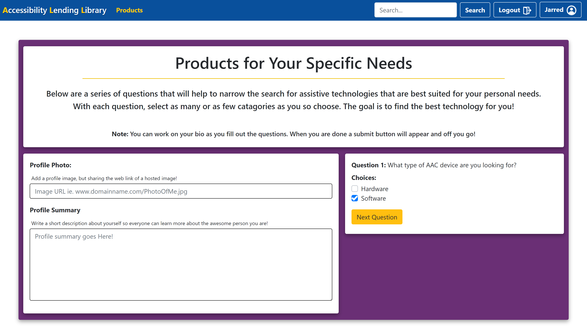
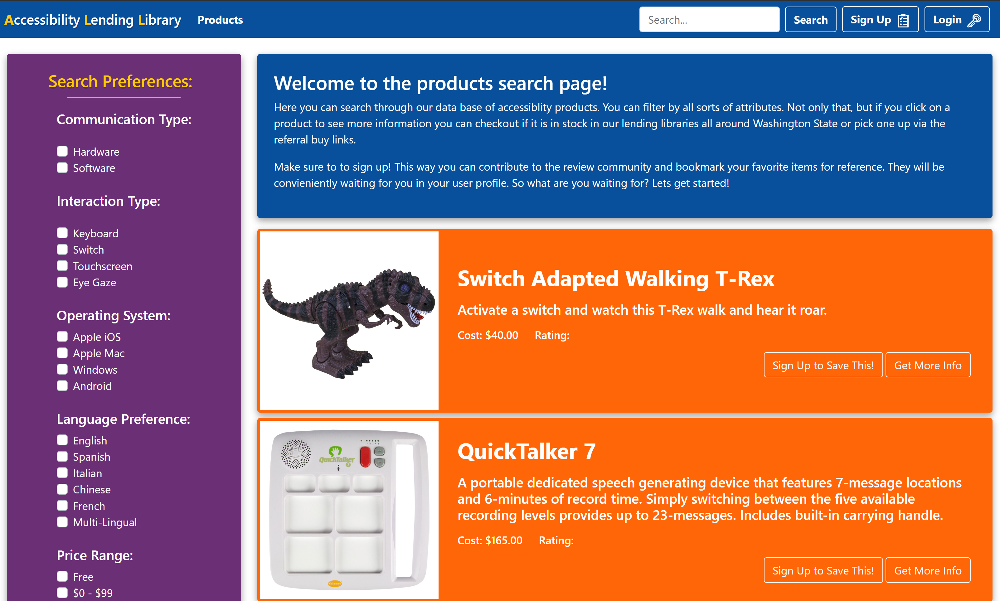
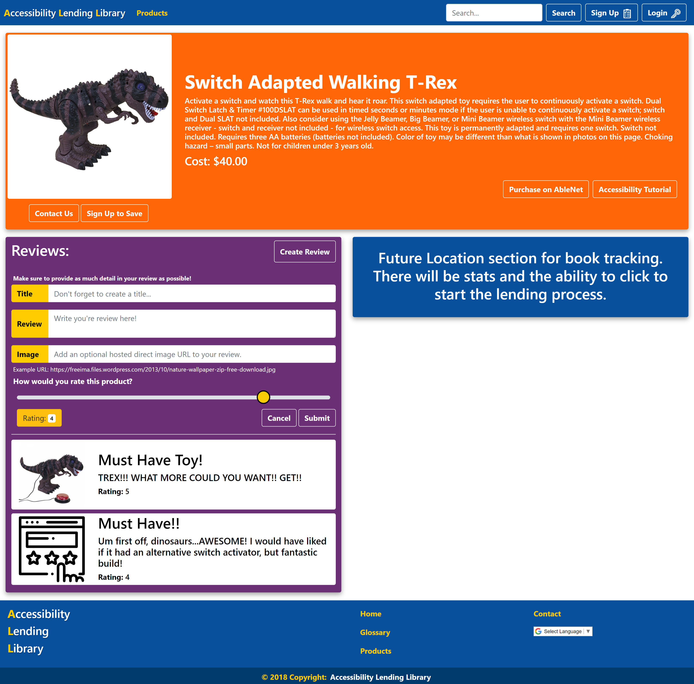

# Accessibility Lending Library - ALL
>The Accessibility Lending Library is a community based website that houses products that have been reviewed from university sources and occupational therapists that are accessible friendly. Not only is it a database of information, it allows users to add reviews and learn how to modify products of their own, learn where to purchase them, or rent one from a local Accessiblity Lending Library. 

## Technologies Used

## Home Page

>On the Home page is the mission statement, access to all content and the full breakdown of the functionality of the website. In addition the welcome image is customized with the user and a custom greeting.

## Sign Up

>Here, Should the user choose, is the process to become part of the Lending Libraries community. Each user is asked for full name, user name of their choosing, and password. This allows for consistent access to products that are functionally relevant for each user and require less time to fine when directly linked to their personal profile. 
>
>After clicking 'Sign Up', the page slides over to the login page where they can access their profile page and setup their attributes.

## Log In

>Where we ask for the same required data to move into the users new profile and curate their results, allowing for ease of access. 

## User Walkthrough 

>Once the user has authenticated their profile, a user walkthrough setup helps find the best products for the user, which will then populate the search/products page. 

+ Once all of the users attributes have been filled out, the page redirects to the landing page where they see their custom welcome greeting.

## Products Page

>Is populated with content using the specifications of the attributes chosen (if zn account is created). There is no requirment to choose any at all, but the more specific the request the better the response! 
>
>All users should be able to choose which item is best suited for their specific needs, and ask additional questions. 
>
>The Search algorhitm was built to find different data not requiring the full search terms. It also detects if you are logged in, or where you are coming from on the website and searches accoridngly. ie. clicking products will load the inventory pre-filtered to your attributes.

* This is all built utilizing a single search function with a logic function that constructs different types of inquiries or locations of search becomes plug in play. No need for a myriad of search functions and built for simplicity and reduced code burden.

## Individual Product Page

>This page holds reviews and create a review function, as well as links to places to purchase, tutorials to learn to modify the product, or save the item to their users wishlist, viewable in their portfolio.

## Wish List

>Should any user want to keep track of the products that has been pulled from the data base, they need only click the 'save' button and it attaches itself to the user profile as a wishlist item!

## Glossary

> This page breaks down both common and uncommon vernacular used, should there be any questions about meaning or purpose of a product.

## Admin Insights

> When an administrator logs in, they have access to the use and statistics of the website as a whole. Searches, recent check outs, ways to improve the Library for all who use it (deeepr insights being built).

### If there is any need for clarification or the user doesnt see a product that fits their specific need then of course ...

## ...Contact Us!

> Let us know what you would like to see or just send a bit of love! We are here to make products more accessible for others, and improving that mission is our whole goal

### Homepage: http://allfor.life/
